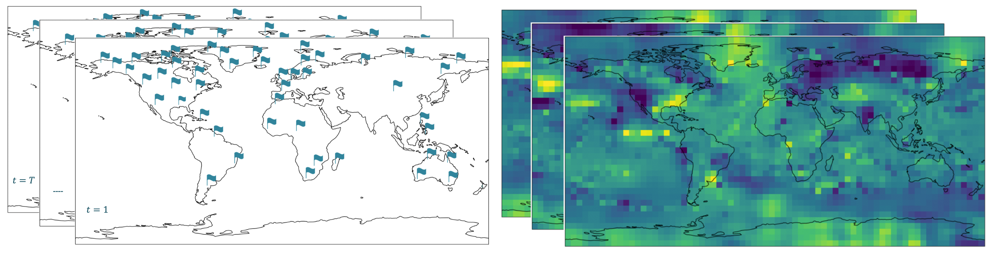
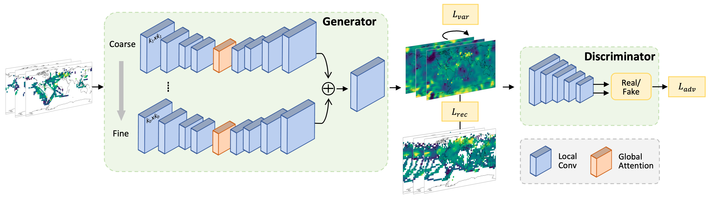

# ESC-GAN

This is the Pytorch implementation for WSDM'22 paper [ESC-GAN: Extending Spatial Coverage of Physical Sensors](https://dl.acm.org/doi/10.1145/3488560.3498461). We extend the spatial coverage of analysis based on existing sensory data, that is, to “generate” data for locations where no historical data exists, by modeling local, global, and multi-scale spatio-temporal structure in an adversarial training framework. The ESC-GAN framework can also be applied to spatio-temporal imputation task.


*Our task of extending spatial coverage: based on the sparse sensory measurements over time in the left figure, we aim to extend its coverage to the entire globe as shown in the right figure.*


*An overview of our ESC-GAN: The multi-branch generator takes as input grid maps with data missing at many locations, and the generator then produces grid maps with all the missing grid cells recovered. We feed the recovered maps together with ground-truth maps to the discriminator for a real or fake classification. We combine three loss functions, i.e., reconstruction loss, variation loss, and adversarial loss.*


## Dataset

CMAP: `data/CMAP.nc`, CMAP Precipitation data is provided by the NOAA/OAR/ESRL PSL, Boulder, Colorado, USA, from their website at https://psl.noaa.gov/

HadCRUT: `data/HadCRUT.nc`, available on Climate Research Unit website: https://crudata.uea.ac.uk/ 

## File Structure

* `run_prep.sh`, `train_prep.py`: train ESC-GAN on CMAP dataset

* `run_hadcrut.sh`, `train_hadcrut.py`: train ESC-GAN on HadCRUT dataset

* `data.py`: prepare CMAP dataset and HadCRUT dataset

* `loss.py`: reconstruction loss and variation loss for training ESC-GAN

* `models/Generator.py`: generator in ESC-GAN

* `models/Discriminator.py`: discriminator in ESC-GAN

* `models/NonLocalBlock.py`: global attention module 

* `models/spectral_norm.py`: spectral norm in GAN training

## Quick Start

```
git clone https://github.com/xiyuanzh/ESC-GAN.git
cd ESC-GAN
mkdir log
mkdir model
```


train ESC-GAN on CMAP precipitation dataset:

```bash run_prep.sh```

train ESC-GAN on HadCRUT dataset:

```bash run_hadcrut.sh```

train ESC-GAN on custom dataset:

1. Prepare numpy data of shape `(n,t,h,w,c)`, where `n` is the number of spatio-temporal sequences, `t` is the time length, `h` is the latitude length, `w` is the longitude length, `c` is the number of channels (i.e., variables). 

2. Prepare numpy mask of shape `(h,w,c)` for evaluation, where `h` is the latitude length, `w` is the longitude length, `c` is the number of channels (i.e., variables). 


## Citation

If you find the code useful, please cite our paper:

```
@inproceedings{10.1145/3488560.3498461,
author = {Zhang, Xiyuan and Chowdhury, Ranak Roy and Shang, Jingbo and Gupta, Rajesh and Hong, Dezhi},
title = {ESC-GAN: Extending Spatial Coverage of Physical Sensors},
year = {2022},
isbn = {9781450391320},
publisher = {Association for Computing Machinery},
address = {New York, NY, USA},
url = {https://doi.org/10.1145/3488560.3498461},
doi = {10.1145/3488560.3498461},
booktitle = {Proceedings of the Fifteenth ACM International Conference on Web Search and Data Mining},
pages = {1347–1356},
numpages = {10},
keywords = {generative adversarial network, super resolution, spatio-temporal data, imputation, self-attention},
location = {Virtual Event, AZ, USA},
series = {WSDM '22}
}
```
